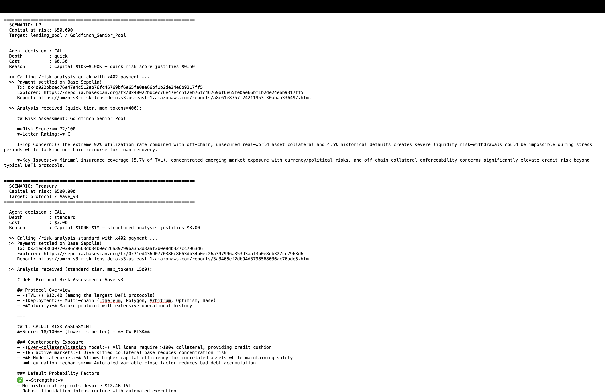
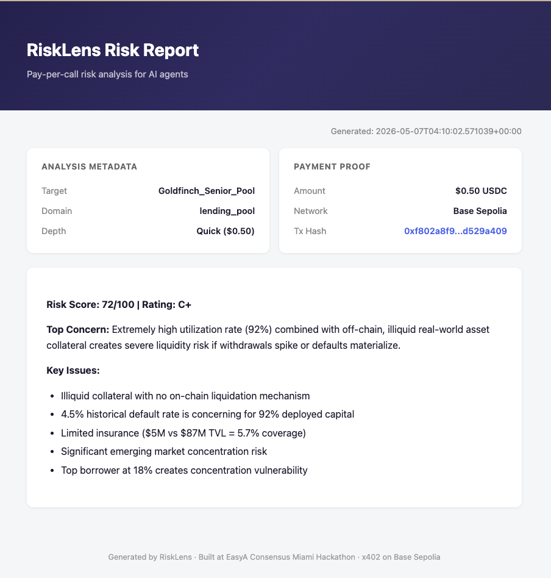
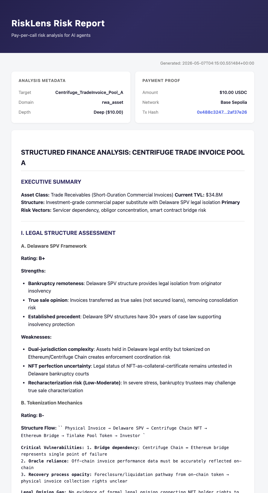
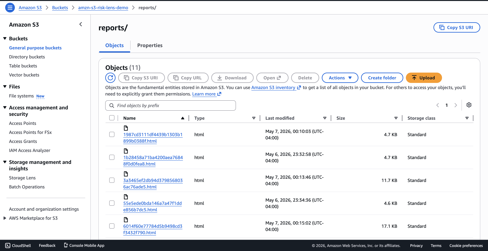

# RiskLens

**AI-powered financial risk analysis, pay-per-call via x402 on Base Sepolia.**

## Demo Video

[Loom walkthrough — to be added]

## Problem

AI agents making financial decisions need risk analysis — but existing APIs are either free-and-shallow or expensive-and-overkill. There's no way for agents to pay only for the depth they need. RiskLens solves this with tiered, pay-per-call risk analysis monetized through Coinbase's x402 protocol: agents route to the right tier based on capital at stake, and pay in USDC on Base Sepolia.

## Architecture

```
┌──────────────────┐          x402 payment          ┌────────────────────┐
│                  │  POST + Payment-Signature hdr   │                    │
│   Demo Client    │ ──────────────────────────────► │  FastAPI :4021     │
│   (AI Agent)     │                                 │                    │
│                  │ ◄────────────────────────────── │  x402 Middleware   │
│  Stakes-Based    │     402 or Analysis JSON        │         │          │
│  Router          │                                 │    ┌────▼─────┐    │
└──────────────────┘                                 │    │ Anthropic │   │
                                                     │    │ Claude    │   │
        Capital at Risk → Depth Tier                 │    └──────────┘   │
        < $10K     → skip (free data)                └────────────────────┘
        $10K-$100K → quick  ($0.50)                          │
        $100K-$1M  → standard ($3.00)                  Base Sepolia
        > $1M      → deep ($10.00)                    eip155:84532
```

## Setup & Run

```bash
# 1. Clone and set up environment
conda create -n risk-lens python=3.11
conda activate risk-lens
pip install -r requirements.txt

# 2. Configure .env
cp .env.example .env  # then add your keys
# ANTHROPIC_API_KEY=sk-ant-...
# PAY_TO_ADDRESS=0x...  (your Base Sepolia address)
# CLIENT_PRIVATE_KEY=0x...  (funded Base Sepolia wallet for demo client)

# 3. Start the server
uvicorn server.main:app --port 4021 --reload

# 4. Run the demo client (in another terminal)
conda activate risk-lens
python -m client.demo_client
```

## Endpoints

| Endpoint | Price (USDC) | Depth | Max Tokens |
|---|---|---|---|
| `POST /risk-analysis-quick` | $0.50 | Score + rating + one-liner | 400 |
| `POST /risk-analysis-standard` | $3.00 | Credit, liquidity, market risk | 1,500 |
| `POST /risk-analysis-deep` | $10.00 | 3-scenario stress test | 3,000 |
| `GET /` | Free | Service info | — |
| `GET /health` | Free | Health check | — |

Request body: `{"domain": "lending_pool|rwa_asset|protocol|wallet", "target": "<key>"}`

## Live Demo & Outputs

### Agent Perspective (Terminal Demo)



The demo client decides whether to call the API based on capital at risk, pays via x402 on Base Sepolia, receives the analysis text, and prints the BaseScan tx hash and S3 report URL.

### Sample Risk Reports (S3-hosted, public)

Each paid analysis produces a permanent, shareable HTML report on AWS S3, including the on-chain payment proof.



Quick tier ($0.50) — concise risk score, letter rating, top concern, key issues. ~80 words.



Deep tier ($10.00) — full structured-finance analysis with stress-test scenarios, legal structure assessment, tokenization mechanics review.

### AWS S3 Storage



All paid reports stored in an S3 bucket (us-east-1) with public read on the `reports/` prefix. Each report keyed by UUID, accessible without authentication.

## How the Blockchain Interaction Works

RiskLens uses the [x402 protocol](https://www.x402.org/) (by Coinbase) to gate API access behind on-chain USDC payments on Base Sepolia. Here is the full flow:

1. **Agent calls a protected endpoint** (e.g. `POST /risk-analysis-quick`) without a payment header. The server's x402 middleware intercepts the request and returns **HTTP 402 Payment Required** with a base64-encoded `payment-required` header containing the payment terms: scheme (`exact`), network (`eip155:84532`), USDC asset address, amount, and payTo address.

2. **The client's x402 SDK parses the 402 response**, constructs an [EIP-3009](https://eips.ethereum.org/EIPS/eip-3009) `transferWithAuthorization` payload for the required USDC amount, and **signs it with the agent's private key** (no on-chain transaction from the client — just a signature).

3. **The client retries the same request** with the signed payment attached in the `X-PAYMENT` header. The server forwards the signature to the **x402 facilitator** (`x402.org/facilitator`), which verifies the signature and **submits the USDC transfer on Base Sepolia**.

4. **Once settlement confirms**, the middleware lets the request through. The server calls Claude, generates the risk analysis, and returns it. The settlement transaction hash is included in the `payment-response` header.

5. **The client extracts the tx hash**, generates an HTML report with a clickable [BaseScan](https://sepolia.basescan.org) link to the settlement transaction, and uploads it to S3 for public, shareable access.

Every payment is a real USDC transfer on Base Sepolia, verifiable on-chain.

## Tech Stack

- **Server**: FastAPI + Uvicorn
- **Payments**: x402 SDK v2.9 (Coinbase x402 protocol) on Base Sepolia
- **AI**: Anthropic Claude (claude-sonnet-4-5 via direct API)
- **Reports**: S3-hosted HTML reports (public URLs, shareable)
- **Client**: Python requests with stakes-based routing logic

> **Note on AWS Bedrock**: Originally built for AWS Bedrock compatibility — Bedrock was blocked on the hackathon AWS account. Switching is a one-line change in `server/llm_client.py`.

## Project Structure

```
server/
  main.py        — FastAPI app + x402 middleware
  llm_client.py  — Anthropic Claude abstraction
  prompts.py     — Domain prompts + depth instructions
  mock_data.py   — Realistic sample data (4 domains)
  report.py      — HTML report generation + S3 upload
client/
  demo_client.py — Stakes-based routing demo
```

## Submission

**EasyA Consensus Miami Hackathon** — Coinbase x AWS Agentic Track
